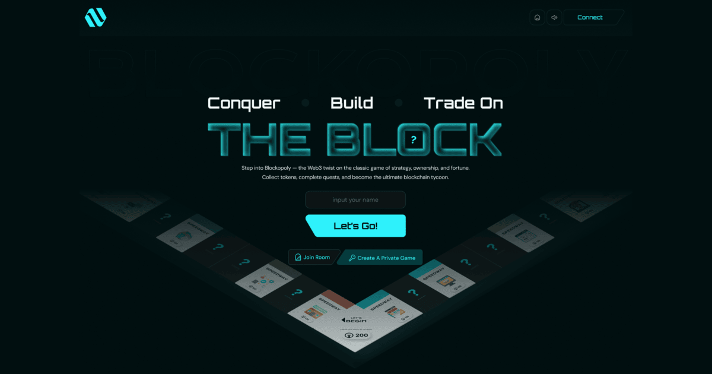

# 🏛️ Tycoon on Stellar — Frontend



## 📌 Overview

**Tycoon on Stellar** Frontend is the user interface for a decentralized board-game experience on **Stellar / Soroban**. Built with **Next.js**, **Tailwind CSS**, and Stellar wallet tooling, it delivers a modern, responsive UI that connects to on-chain game logic in **Rust (Soroban)**. Players can interact with the board, buy and sell properties, roll dice, and trade digital assets in a trustless, blockchain-powered environment—without leaving the Stellar ecosystem.

> **Note:** This README documents the Blockopoly web client only. Other components (e.g. Soroban contracts) live in separate repositories.

The UI targets both **mobile and desktop** responsive layouts.

> **Scope note:** Deploying on-chain smart contracts is out of scope for this repository. This repo is the frontend client only; contract deployment is handled elsewhere.

This repository contains the Next.js frontend only; the Soroban smart contracts live in a separate repository.

## ♿ Accessibility

Primary navigation should remain keyboard reachable.

## ✨ Features

- **Responsive Tycoon UI** — Game board, property cards, dice, and modals (Figma-driven), styled with Tailwind CSS.
- **Stellar integration** — Connect wallets, sign transactions, and read game state via Stellar SDK and wallet adapters.
- **On-chain interaction** — Live updates for moves, property purchases, and trades through Soroban smart contracts.
- **Sponsored / smooth UX** — Optional fee sponsorship (e.g. platform-paid fees) so players focus on gameplay, not gas tokens.
- **TypeScript** — Type-safe components and contract interactions, aligned with Soroban backend contracts.
- **Decentralized gameplay** — UI reflects trustless rules enforced on-chain.

## 🔧 Tech Stack

- **Next.js 15** — App Router for fast, server-rendered React pages.
- **Tailwind CSS v4** — Custom styling for the board-game aesthetic.
- **Stellar SDK** — Build, simulate, and submit transactions; read ledger state.
- **Wallet kit** — Freighter (and compatible Stellar wallets) for connect/sign flows.
- **Soroban** — On-chain game logic (Rust contracts; separate repo).
- **TypeScript** — Strong typing across UI and chain calls.
- **ESLint** — Code quality, integrated with Next.js.
- **Figma** — Source for board and component design.

## 🔤 Fonts

Brand fonts are loaded via `next/font/google` in `app/layout.tsx` and exposed as CSS variables on the root layout:

- **Orbitron** — display headings (hero title, section titles, logo wordmark). Exposed as `--font-orbitron` and applied through the `font-display` utility.
- **DM Sans** — primary body text (paragraphs, buttons, form fields, navigation). Exposed as `--font-dm-sans` and applied through the `font-sans` utility.

Use `font-display` for headings and `font-sans` for body copy so typography stays consistent across the app.

## 🔒 Security

**Never paste your seed phrase or private keys into the app UI.** No legitimate interface—including this one—should ever ask for them. Wallet connections and transaction signing happen through your wallet extension (e.g. Freighter); your secret recovery phrase and private keys must stay offline and private at all times.

## 🚀 Getting Started

### Prerequisites

- **Node.js** ≥ 18.0.0
- **pnpm** (preferred package manager) — or **npm** / **yarn**
- **Stellar wallet** (e.g. [Freighter](https://www.freighter.app/))
- Access to **Tycoon on Stellar** Soroban contracts (see Contract repo)
- **Supported browsers** — latest **Chrome**, **Firefox**, and **Safari**

### 1️⃣ Clone the repository

```bash
git clone https://github.com/YOUR_ORG/tycoon-on-stellar-frontend.git
cd tycoon-on-stellar-frontend
```

## Handsoff notes

<!-- handsoff-issue-322 -->
- #322: GameSettings: merge duplicate canStart gates (wallet + room fields)

### 2️⃣ Install Dependencies

```bash
pnpm install
```

## 🧪 Testing

- No test suite is configured yet; tests are not run as part of this project.

Unit tests are welcome! If you'd like to contribute tests, please open a pull request with your additions. This section is a stub and will be expanded as the test suite grows.

### Branch naming

When creating a branch, use a short, descriptive name in the format `feature/short-description` (for example, `feature/wallet-connect`).

## 📝 Changelog

See the [GitHub Releases](https://github.com/YOUR_ORG/tycoon-on-stellar-frontend/releases) page for the latest changes.

## ❓ FAQ

**Wallet not connecting?** Refresh the page and unlock your wallet extension, then try connecting again.

### 🌐 Network

Test gameplay targets **Starknet Sepolia** unless otherwise configured.

### 3️⃣ Environment variables

Variables prefixed with `NEXT_PUBLIC_` are exposed to the browser — do not put secrets there.

Create a `.env.local` file in the project root and add the required variables (e.g. Stellar network, contract IDs, RPC URL). Refer to `.env.example` if provided.

### 4️⃣ Run the development server

```bash
pnpm dev
```

After running `pnpm dev`, the app runs at [http://localhost:3000](http://localhost:3000).

### 5️⃣ Build for production

```bash
pnpm build
pnpm start
```

## 📜 Scripts

- `pnpm dev` — Start the development server.
- `pnpm build` — Create a production build.
- `pnpm start` — Start the production server.
- `pnpm lint` — Run ESLint.

## 📝 Development Notes

- **TypeScript-first:** This codebase is TypeScript-first. New pages and components should be written as `.tsx` (or `.ts`) files rather than plain JavaScript. Avoid adding `.js`/`.jsx` pages.

## 🤝 Contributing

> **Tip:** Before starting large refactors, please open a GitHub issue first to discuss the proposed changes.

Found a bug or have an idea? Please open a GitHub Issue so we can track it.
We welcome contributions via pull requests once an issue is discussed.

Contributions are welcome! Please open an issue or submit a pull request. Ensure your changes follow the existing code style and pass linting before submitting.

## 📄 License

See the [LICENSE](./LICENSE) file for details, or visit the [GitHub license tab](https://github.com/YOUR_ORG/tycoon-on-stellar-frontend/blob/main/LICENSE).